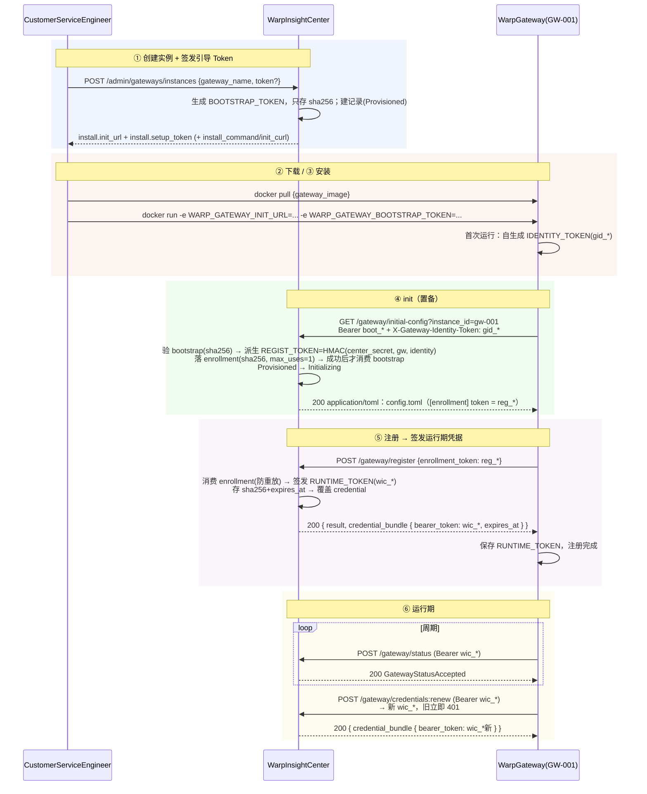

# WarpGateway 接入 WarpInsightCenter 完整流程（下载 / 安装 / init / 注册 / 运行期）

> 本文档描述 **网关（WarpGateway）** 从中心侧创建、下载、安装、初始化（init）、注册到运行期上报的端到端流程。
> 与 agent（warp-insightd）的 enrollment 协议（`identity-enrollment-protocol.md`）不同，网关使用
> **四 token 凭据链**：`BOOTSTRAP_TOKEN → IDENTITY_TOKEN → REGIST_TOKEN → RUNTIME_TOKEN`，注册后不依赖 mTLS。

## 1. 参与方与角色

| 角色 | 说明 |
|---|---|
| CustomerServiceEngineer（管理员） | 在 Center 创建网关实例、获取安装材料、从 admin 页面复制 `setup_token` |
| WarpInsightCenter（中心） | 创建实例、签发引导 token、置备、签发运行期凭据、接收状态 |
| WarpGateway（网关 / GW-001） | 部署在边缘的容器实例；首次运行自生成身份，置备后注册并周期上报 |
| gateway-ins | 网关实例内部运行的上报/注册组件（消费 config.toml 的 `[enrollment] token`） |

## 2. 四 Token 凭据链

| Token | 精确标识 | 前缀 | 生成方 | 中心存储 | 生命周期 |
|---|---|---|---|---|---|
| 置备引导 | `BOOTSTRAP_TOKEN` | `boot_` | center @ create | 只存 `sha256` | init-url 置备鉴权，一次性，**初始化后不可再生成**；明文仅 admin 页面可见 |
| 网关身份 | `IDENTITY_TOKEN` | `gid_` | 网关首跑自生成 | **不存** | 仅置备调用头 `X-Gateway-Identity-Token` 上交一次 |
| 注册凭据 | `REGIST_TOKEN` | `reg_` | center 派生 | 存 `sha256`（enrollment token） | 进 config.toml，`/register` 消费一次 |
| 运行期凭据 | `RUNTIME_TOKEN` | `wic_` | center @ register 签发 | 存 `sha256` + 过期 | 运行期 Bearer，可 `credentials:renew` 轮换 |

## 3. 端到端时序



## 4. 分阶段明细

### ① 创建实例 + 签发引导 Token（admin create）

```
POST /api/v1/admin/gateways/instances
Authorization: Bearer <admin_token>
{ "gateway_name": "gw-001", "requested_by": "ops", "token": "boot-xxx"(可选) }
```

- center 生成 `BOOTSTRAP_TOKEN`（`boot_` 前缀；不传 `token` 则由中心 `new_secret_token` 生成），**只存 sha256**。
- 响应 `install`：
  - `init_url` = `GET {center}/api/v1/gateway/initial-config?instance_id=gw-001`（**不含 token**）
  - `setup_token` = 明文引导 token（仅此一次交付给管理员，admin 页面展示）
  - `install_command` / `init_curl`：便捷命令

> config.toml **不**在 create 生成——由网关调 init-url 置备时即时生成（见 ④）。

### ② 下载

- 网关镜像：`docker pull {gateway_image}`（默认 `warp-gateway:latest`）。
- 版本制品（可选）：`POST /api/v1/admin/releases` 发布 → `GET /api/v1/releases/artifact/{component}/{version}/{filename}` 下载校验。

### ③ 安装

```
docker run -d --name warp-gateway-gw-001 \
  -e WARP_GATEWAY_INIT_URL=http://center:3100/api/v1/gateway/initial-config?instance_id=gw-001 \
  -e WARP_GATEWAY_BOOTSTRAP_TOKEN=boot_xxx \
  {gateway_image}
```

- 首次运行：网关**自生成 `IDENTITY_TOKEN`**（`gid_` 前缀，长期身份密钥，中心不存）。

### ④ init（置备，ProvisionGatewayFlow）

```
GET /api/v1/gateway/initial-config?instance_id=gw-001
Authorization: Bearer <bootstrap_token>
X-Gateway-Identity-Token: <identity_token>
```

center 处理（仅未初始化网关）：

1. 校验 `bootstrap_token`（sha256 常数时间比较）；不匹配 → 401。
2. 读取 `identity_token`（请求头）。
3. **派生** `REGIST_TOKEN = HMAC-SHA256(center_secret, "gateway-reg:" + gateway_id + ":" + identity_token)`。
4. 落 **enrollment token**（`sha256(regist)`，`max_uses=1`、Active）——供 ⑤ 消费。
5. **成功落库后才消费 bootstrap**（一次性；网络抖动可重试）。
6. 生命周期 `Provisioned → Initializing`。
7. 生成 **config.toml**（`application/toml`）：

```toml
version = 1

[control_center]
endpoint = "http://center:3100"
trust_bundle = "/etc/warp-gateway/ca/control-center.pem"
server_tls_required = false

[enrollment]
token_id = "enroll-gw-001-1"
token = "reg_..."

[protocol]
version = "1.0"
```

> 已初始化网关（有 RUNTIME_TOKEN）再调 initial-config：`Bearer <runtime_token>` → 返回同一 config.toml（`[enrollment] token` 省略，因网关已注册）。

### ⑤ 注册 → 签发运行期凭据

```
POST /api/v1/gateway/register
{ "enrollment_token": "<regist_token>", "instance_id": "inst-1", "requested_at": "..." }
```

1. 消费 enrollment token（防重放 / 限量 / 吊销 / 过期校验）。
2. **签发独立 `RUNTIME_TOKEN`**（`wic_` 前缀 + `credential_id` + `expires_at = now + credential_ttl`）。
3. 原子替换网关注册记录里的 `credential_token_hash` → 旧 seed/引导凭据立即失效。
4. 响应携带 `credential_bundle`：

```json
{
  "result": {
    "status": "accepted",
    "gateway_id": "gw-001",
    "instance_id": "inst-1",
    "credential_bundle": {
      "credential_id": "cred_...",
      "gateway_id": "gw-001",
      "auth_scheme": "bearer",
      "bearer_token": "wic_...",
      "issued_at": "...",
      "expires_at": "..."
    }
  }
}
```

### ⑥ 运行期

- 周期上报：`POST /api/v1/gateway/status`（`Bearer <runtime_token>`）。
- 凭据轮换：`POST /api/v1/gateway/credentials:renew`（`Bearer <当前 runtime_token>` + `{gateway_id, instance_id}`）→ 新 `wic_*`，**旧 token 立即 401**。

## 5. 安全性质

| 性质 | 实现 |
|---|---|
| 引导凭据一次性 | `bootstrap_token` 置备成功后消费；**初始化后不可再生成**（rotate 仅 Provisioned 且未消费时允许） |
| 引导 token 泄露面分离 | 明文仅 admin 页面一次性展示；`init_url` 不含 token；中心只存 sha256 |
| 注册凭据与网关身份强绑定 | `REGIST_TOKEN` 由网关自生成身份 `IDENTITY_TOKEN` 派生，中心 `hmac_secret` 持有派生能力 |
| 泄露 config.toml 拿不到运行期身份 | `REGIST_TOKEN` 只做一次性注册；真网关注册后，`REGIST_TOKEN` 作 Bearer → **401**（运行期分离） |
| 运行期凭据可恢复 | `RUNTIME_TOKEN` 有 `expires_at` + 可 `credentials:renew` 轮换；泄露后持旧 token 也可被新 token 覆盖失效 |
| 中心不存明文 | 三种 token 中心均只存 `sha256`（`IDENTITY_TOKEN` 根本不存） |

## 6. 关键端点汇总

| 端点 | 方法 | 鉴权 | 角色 |
|---|---|---|---|
| `/api/v1/admin/gateways/instances` | POST | admin bearer | 创建实例 + 签发 bootstrap |
| `/api/v1/admin/gateways/{id}/bootstrap-tokens/rotate` | POST | admin bearer | 初始化前重发引导 token |
| `/api/v1/gateway/initial-config?instance_id=` | GET | 置备：`bootstrap + identity`；已初始化：`runtime` | 置备 + 出 config.toml |
| `/api/v1/gateway/register` | POST | `enrollment_token = regist` | 注册 + 签发运行期凭据 |
| `/api/v1/gateway/status` | POST | `Bearer runtime` | 状态上报 |
| `/api/v1/gateway/credentials:renew` | POST | `Bearer runtime` | 凭据轮换 |

## 7. 相关文档

- [`identity-enrollment-protocol.md`](identity-enrollment-protocol.md)（agent 侧 enrollment，mTLS）
- [`agent-gateway-protocol.md`](agent-gateway-protocol.md)
- [`control-center-architecture.md`](control-center-architecture.md)
- [`../foundation/security-model.md`](../foundation/security-model.md)
